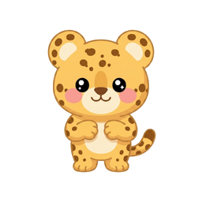
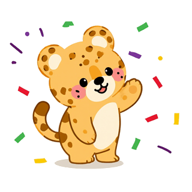

<div align="center">



# Anakara

**Belajar gizi & pola hidup sehat jadi seru! 🥦⭐**

Platform belajar gamifikasi untuk anak SD kelas 1–2 (Fase A, Kurikulum Merdeka) —
ditemani **Tayo si Macan Kecil** 🐆

[](https://nextjs.org)
[](https://react.dev)
[](https://www.typescriptlang.org)
[](https://tailwindcss.com)
[](https://firebase.google.com)

</div>

---

## 🌟 Apa itu Anakara?

**Anakara** adalah website edukasi **gizi & pola hidup sehat** (makanan bergizi + olahraga)
untuk **anak usia 6–8 tahun di Indonesia**, dikemas lewat game, cerita, dan koleksi kartu.
Dirancang untuk dipakai di lingkungan sekolah: **ringan, aman, dan jelas** untuk anak yang
belum lancar membaca — ikon besar, teks pendek, dan maskot yang selalu menyemangati
(*"Yuk coba lagi!"*, bukan menghukum).

> Prioritas #1: pengalaman anak yang **menyenangkan, aman, dan tidak membingungkan** —
> bukan kecanggihan teknis.

<div align="center">


*Tayo si Macan Kecil — pemandu di sepanjang aplikasi* 🐆
</div>

---

## 🎮 Fitur

| | Fitur | Rute | Serunya |
|---|---|---|---|
| 🍽️ | **Isi Piringku** | `/game/isi-piringku` | Drag & drop makanan ke 4 kelompok (Makanan Pokok, Lauk-Pauk, Sayuran, Buah) — 3 level, bisa juga mode ketuk |
| 🧠 | **Kuis Asik** | `/game/kuis` | 10 soal berwaktu 15 detik, 3 level lock/unlock, jawaban terkunci lalu auto-lanjut |
| ⚔️ | **Team Battle 2v2** | `/game/battle` | Duel tim real-time (kode tim 4 huruf), lawan bot "Tim Robo" kalau sepi, menang → **kotak misteri** 🎁 |
| 📖 | **Cerita Interaktif** | `/game/cerita` | Buku dengan efek balik halaman, narasi suara (TTS Bahasa Indonesia), pertanyaan di tengah cerita |
| 🎬 | **Video Belajar** | `/game/video` | Feed vertikal gaya reels — konten internal saja, tanpa komentar, aman untuk anak |
| 🃏 | **Koleksi Kartu** | `/koleksi` | Album 24 kartu ber-rarity (Biasa 70% · Langka 25% · Legenda 5%), duplikat jadi +25⭐ |
| 🏆 | **Leaderboard** | `/leaderboard` | Podium 🥇🥈🥉 + ranking ⭐, filter Kelasku / Semua |
| 🏫 | **Kelasku** | `/kelas` | Lihat guru dan teman sekelas |
| 🧑‍🏫 | **Dashboard Guru** | `/guru` | Buat kelas (kode undangan à la Kahoot), pantau progress siswa, bank soal custom |

**Progression:** semua aktivitas menghasilkan ⭐ poin; level siswa = `1 + ⌊poin/150⌋`,
dengan perayaan "🎉 naik Lv" di layar hasil. Konten terkunci selalu jelas syaratnya
(*"Selesaikan Level 2 untuk buka ini!"*).

---

## 🛠️ Tech Stack

- **[Next.js 15](https://nextjs.org)** (App Router) + **TypeScript** + **React 19**
- **[Tailwind CSS v4](https://tailwindcss.com)** — design token semantik via `@theme inline` di `app/globals.css`
- **[Firebase](https://firebase.google.com)** — Google OAuth (Auth), **Firestore** (data), **Realtime Database** (Battle 2v2)
- **[dnd-kit](https://dndkit.com)** — drag & drop ringan dan mobile-friendly
- **Baloo 2 + Nunito** via `next/font/google` (self-host, hanya weight yang dipakai)

Semua pasangan warna **lolos kontras WCAG** (terang **dan** gelap) — verifikasi:
`node scripts/cek-kontras.mjs`. Design system hidup ada di `design-system.html` dan
galeri komponen di `/dev/komponen`.

---

## 🚀 Mulai Cepat

**1. Install dependency**

```bash
npm install
```

**2. Siapkan Firebase**

Buat project di [Firebase Console](https://console.firebase.google.com), lalu:

1. Aktifkan **Authentication → Google**
2. Buat **Firestore** dan publish rules dari [`firestore.rules`](firestore.rules)
3. (Untuk Battle 2v2) Buat **Realtime Database** dan publish rules dari [`database.rules.json`](database.rules.json)

**3. Isi environment variables**

Salin bagian Firebase dari [`.env.example`](.env.example) ke `.env.local`:

```bash
NEXT_PUBLIC_FIREBASE_API_KEY=...
NEXT_PUBLIC_FIREBASE_AUTH_DOMAIN=...
NEXT_PUBLIC_FIREBASE_PROJECT_ID=...
NEXT_PUBLIC_FIREBASE_STORAGE_BUCKET=...
NEXT_PUBLIC_FIREBASE_MESSAGING_SENDER_ID=...
NEXT_PUBLIC_FIREBASE_APP_ID=...
NEXT_PUBLIC_FIREBASE_DATABASE_URL=...   # untuk Battle 2v2
```

**4. Jalankan**

```bash
npm run dev
```

Buka [http://localhost:3000](http://localhost:3000) 🎉

> 💡 Halaman uji tanpa login: `/dev/komponen` (galeri komponen), `/dev/cerita`,
> `/dev/guru`, dan `/dev/tema?set=dark&ke=/` (paksa tema untuk screenshot).

---

## 📁 Struktur Proyek

```
anakara/
├── app/                  # Rute Next.js (App Router)
│   ├── game/             #   isi-piringku · kuis · battle · cerita · video
│   ├── onboarding/       #   pilih avatar → join kelas via kode
│   ├── guru/             #   dashboard guru
│   └── dev/              #   halaman uji tanpa login
├── features/             # Modul per-fitur (komponen + api Firestore)
│   ├── auth/             #   Google OAuth, profil, avatar, hitungLevel()
│   ├── games/            #   battle · cerita · isi-piringku · kuis · video
│   ├── guru/ kelas/ koleksi/ leaderboard/ home/
├── components/
│   ├── ui/               # Button pop, Card, Modal, Spinner Tayo, TombolKembali, ...
│   └── deko/             # dekorasi playful (BlobMata, Squiggle, LatarDoodle, ...)
├── data/                 # Konten siap-impor: 32 makanan, 30 soal, 24 kartu,
│                         #   cerita Bab 1, metadata video (lihat data/README.md)
├── lib/                  # firebase.ts (Firestore) · firebase-rtdb.ts (Battle)
├── scripts/              # CLI generate asset via Gemini + cek-kontras.mjs
└── public/assets/        # logo, maskot, avatar, makanan, kartu, ...
```

---

## 🎨 Prinsip Desain

1. **Untuk anak yang belum lancar membaca** — ikon besar, ilustrasi, teks pendek
2. **Mudah di-tap** — target sentuh ≥ 44×44 px
3. **Warna tak pernah sendirian** — benar/salah selalu + ikon + teks (aman buta warna)
4. **Feedback salah menyemangati**, tidak menjatuhkan
5. **Aman untuk anak** — tanpa komentar, tanpa embed eksternal
6. **Ringan** — animasi playful tapi hemat, hormati `prefers-reduced-motion`
7. **Dua tema** — terang & gelap, token semantik yang sama

---

## 📚 Dokumen Penting

| Berkas | Isi |
|---|---|
| [`FOUNDATION.md`](FOUNDATION.md) | **Sumber kebenaran** — visi produk, design system, arsitektur, keputusan D1–D12 |
| [`design-system.html`](design-system.html) | Design system hidup (buka di browser) |
| [`daftar-gambar.md`](daftar-gambar.md) | Manifest ±105 asset gambar + prompt siap-copy |
| [`data/README.md`](data/README.md) | Skema & isi konten aplikasi |
| [`catatan-restyle-thynk.md`](catatan-restyle-thynk.md) | Catatan restyle art-style THYNK (D12) |

---

<div align="center">

**Status:** ✅ Semua phase 0–10 selesai · sisa backlog: asset gambar P1/P2, audio narasi, file video

Dibuat dengan 💚 untuk anak Indonesia — bagian dari **PKM "Fase A"**

</div>
